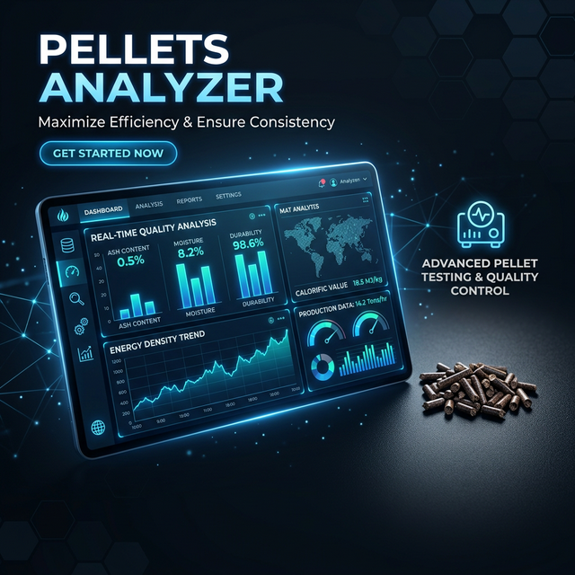

<p align="center">
  
</p>

# Pellets Analyzer — Интеллектуальная экосистема анализа биотоплива

[](https://www.python.org/downloads/)
[](https://flask.palletsprojects.com/)
[](https://scikit-learn.org/)
[](https://opensource.org/licenses/MIT)

**Pellets Analyzer** — это высокотехнологичная аналитическая платформа на базе Flask, предназначенная для комплексного исследования, визуализации и оптимизации характеристик топливных пеллет. Система объединяет в себе инструменты управления лабораторными данными, продвинутый прогнозист на базе машинного обучения и модуль интеллектуальной бизнес-аналитики.

---

## 🎯 Назначение и возможности

### Основные цели системы:
1.  **Сбор и систематизация**: Консолидация разрозненных Excel-отчетов в единую структурированную базу данных SQLite.
2.  **Прогнозирование качества**: Предсказание характеристик будущих партий (теплота сгорания, прочность, зольность) на основе химического и компонентного состава еще до начала производства.
3.  **Оптимизация рецептуры**: Поиск математически идеального соотношения компонентов для достижения заданных свойств при минимальных затратах сырья.
4.  **Интеллектуальный аудит**: Выявление скрытых зависимостей и трендов с помощью алгоритмов ML и ИИ.

### Ключевые функции:
- **Интерактивная визуализация**: Построение 3D-графиков, карт корреляций и временных трендов с использованием Plotly и Seaborn.
- **Сравнение составов**: Детальное сопоставление до 5 различных рецептур одновременно с подсветкой критических отклонений.
- **AI-Ассистент**: Чат-интерфейс для анализа данных на естественном языке ("Какой состав наиболее эффективен по теплоотдаче?").

---

## 🤖 Модуль Машинного Обучения (ML)

Модуль ML (`ml_optimizer.py`) является "сердцем" системы и реализует двухуровневый подход к анализу:

### 1. Прогнозирование (Predictor)
Использует ансамблевые методы машинного обучения для предсказания физико-химических свойств:
- **Алгоритмы**: `Random Forest` и `Gradient Boosting`.
- **Автоматизация**: Встроенный `GridSearchCV` для автоматического подбора гиперпараметров моделей.
- **Стратегия Cold-Start**: Если данных для обучения моделей недостаточно, система автоматически переключается на линейную аппроксимацию свойств на основе характеристик отдельных компонентов, обеспечивая непрерывность работы.
- **Параллельные вычисления**: Обучение моделей для различных свойств (зольность, влажность, калорийность) происходит в многопоточном режиме (`ThreadPoolExecutor`).

### 2. Оптимизация (Optimizer)
Решает задачу поиска оптимального состава пеллет:
- **Математический аппарат**: Используется метод последовательного квадратичного программирования (`SLSQP`) из библиотеки `SciPy`.
- **Гибкие ограничения**: Пользователь может задавать как целевые показатели (например, "максимизировать теплоту сгорания"), так и жесткие рамки по доступности компонентов или бюджету.

---

## 🛠 Технологический стек

Проект построен на современном стеке технологий, обеспечивающем скорость, масштабируемость и простоту развертывания:

| Технология | Назначение | Преимущество |
| :--- | :--- | :--- |
| **Python** | Основной язык разработки | Огромная экосистема библиотек для Data Science. |
| **Flask** | Веб-фреймворк | Легковесность и высокая скорость обработки запросов. |
| **Pandas / NumPy** | Работа с данными | Эффективная обработка больших табличных массивов. |
| **Scikit-Learn** | Машинное обучение | Проверенные и надежные алгоритмы регрессии. |
| **SciPy** | Математическая оптимизация | Мощные алгоритмы для решения нелинейных уравнений. |
| **Plotly / Seaborn** | Визуализация | Сочетание интерактивности в вебе и глубины статического анализа. |
| **SQLite** | База данных | Нулевая конфигурация, высокая переносимость данных. |
| **Vanilla JS** | Frontend логика | Отсутствие тяжелых зависимостей, быстрая загрузка интерфейса. |

---

## 🏗 Подробная архитектура и модули (Структура проекта)

Проект имеет модульную архитектуру, где каждый компонент отвечает за свою строгую зону ответственности, что облегчает масштабирование и поддержку.

### ⚙️ 1. Ядро приложения (Core)
- **`main.py`** — Центральный Flask-контроллер (Backend).
  - Управляет маршрутизацией всех HTTP-запросов (API Endpoints и рендеринг страниц).
  - Контролирует пользовательские сессии и выступает единой точкой входа (Entry point).
  - Является связующим звеном, координирующим обмен данными между интерфейсом, базой данных и ML-ядром.

### 🧠 2. Искусственный интеллект и ML-вычисления
- **`ml_optimizer.py`** — Вычислительное "сердце" системы. Включает в себя:
  - `CompositionParser`: Парсинг, очистка и нормализация текстовых составов пеллет (с помощью Regex).
  - `PelletPropertyPredictor`: ML-предсказатель свойств на базе Random Forest и Gradient Boosting.
  - `MLCompositionOptimizer`: Оптимизатор, ищущий идеальные пропорции сырья с учетом строгих ограничений (использует математический аппарат SciPy).
  - `PelletMLSystem`: Главный фасад, объединяющий все ML-подсистемы воедино.
- **`ai_ml_integration.py`** (`AIMLAnalyzer`) — Модуль текстовой бизнес-аналитики.
  - Анализирует естественные запросы от пользователей.
  - Выявляет скрытые тренды в выборке, преобразует сложные выводы ML-моделей в понятные текстовые отчеты и рекомендации.
- **`ai_integration.py`** — Интеграционный слой AI (для подключения внешних языковых нейросетей с целью обогащения выводов).

### 💾 3. Работа с данными и БД (Data Layer)
- **`database.py`** — Слой доступа к данным (DAO).
  - Инкапсулирует логику работы с локальной SQLite-базой (`pellets_data.db`).
  - Содержит запросы для CRUD-операций: сохранение новых экспериментов, извлечение исторической базы и версионирование обученных ML-моделей.
- **`data_processor.py`** — Системный модуль ETL (Extract, Transform, Load).
  - Реализует интеллектуальный импорт датасетов (Excel, CSV).
  - Автоматически распознает синонимы физических матрик (напр. "Влажность" = "W"), проводит валидацию, очищает пустые значения и стандартизирует типы данных перед их записью в базу.
- **Модули-парсеры Excel** (`read_excel.py`, `parse_excel_robust.py`, `parse_xlsx_native.py`) — Набор утилит для глубокого парсинга специфических лабораторных таблиц и сложных вложенных форматов.

### 📊 4. Визуализация (Presentation Layer)
- **`gui.py`** — Универсальная серверная фабрика графиков.
  - Генерирует сложные интерактивные визуализации (3D-Scatter Plots, графики поверхности отклика) с помощью `Plotly`.
  - Строит статические графики (распределения плотности, Heatmaps) через `Seaborn` и `Matplotlib` (особенно полезно для PDF-выгрузок).

### 🌐 5. Фронтенд (Frontend)
- **`templates/`** — Директория с HTML-шаблонами (Jinja2). 
  - Разметка функциональных страниц: главный дашборд, продвинутый поиск и таблицы, страницы ML-анализа и интерфейсы сравнения матриц (`compare.html`).
- **`static/`** — Клиентские ресурсы:
  - `css/`: Кастомная конфигурация стилей для светлой и темной тем без использования тяжелых фреймворков для мгновенной загрузки.
  - `js/`: Асинхронная логика интерфейса (AJAX-обновления графиков, валидация frontend-форм, динамические UI-эффекты).

---

## 🚀 Быстрый старт

### Установка (Windows)
Просто запустите файл `install.bat`. Он создаст виртуальное окружение, установит зависимости и запустит сервис.

### Ручная установка (Linux / macOS)
```bash
python3 -m venv venv
source venv/bin/activate
pip install -r requirements.txt
python main.py
```

Приложение будет доступно по адресу: `http://localhost:5000/`

---

## 📈 Ценность для бизнеса

1.  **Минимизация брака**: Система заранее предупреждает, если планируемый состав не соответствует стандартам (ГОСТ).
2.  **Экономическая эффективность**: Поиск путей замены дорогостоящего сырья более дешевыми аналогами без потери качества.
3.  **Скорость принятия решений**: Сложные лабораторные расчеты сокращаются с нескольких часов до миллисекунд.

---

## 🤝 Контакты
Разработка: **[sdv301](https://github.com/sdv301)**
Если у вас есть идеи по улучшению ML-модуля, пожалуйста, создайте Issue!
